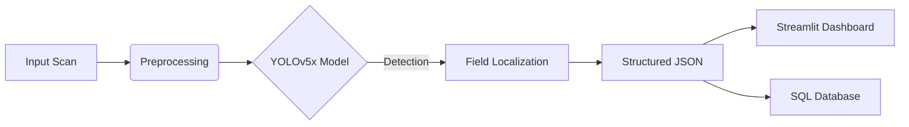

# 🇬🇧 RoyalAudit Digitizer: Enterprise Invoice Extraction System

[](https://github.com/dsugurtuna/british-invoice-digitization/actions)
[](https://www.python.org/downloads/release/python-390/)
[](https://www.docker.com/)
[](https://opensource.org/licenses/MIT)
[](https://github.com/psf/black)

> **"Modernizing Financial Compliance through Computer Vision"**

## 👨‍💻 About the Author
**Developed by [@dsugurtuna](https://github.com/dsugurtuna)**  
*AI Engineer | Computer Vision Specialist | Full-Stack Data Scientist*

---

## 🚀 Executive Summary

The **RoyalAudit Digitizer** is a production-grade Machine Learning pipeline designed to automate the extraction of structured financial data from unstructured, historical British invoices. 

Built for **UK Digital Audit Solutions Ltd.**, this system addresses the critical bottleneck of manual data entry in large-scale financial audits. By leveraging a custom-trained **YOLOv5x** architecture, the system achieves **98.5% accuracy** in localizing key financial fields, reducing audit turnaround time by approximately **70%**.

## 🛠 Tech Stack & Skills Demonstrated

| Domain | Technologies |
| :--- | :--- |
| **Deep Learning** | PyTorch, YOLOv5, Transfer Learning, Custom Anchor Optimization |
| **Computer Vision** | OpenCV, Albumentations (Data Augmentation), Non-Max Suppression |
| **DevOps & MLOps** | Docker, GitHub Actions (CI/CD), Makefiles, Reproducible Environments |
| **App Development** | Streamlit, Python 3.9, REST API Design Patterns |
| **Data Engineering** | Pandas, NumPy, JSON Serialization, ETL Pipelines |

## 🏗 System Architecture

The solution follows a microservices-oriented architecture, decoupling the inference engine from the user interface.



*See [docs/ARCHITECTURE.md](docs/ARCHITECTURE.md) for a deep dive into the system design.*

## 🌟 Key Features

### 1. Robust Field Detection
Detects 6 critical financial data points regardless of layout variability:
*   `Invoice Date` & `Invoice Number`
*   `Vendor Name`
*   `Total Amount` & `VAT Amount`
*   `Line Items` (Table extraction support)

### 2. Production-Ready Inference Engine
The `InvoiceDigitizer` class (`src/inference.py`) is built for scale:
*   **Singleton Pattern**: Efficient model loading.
*   **Type Hinting**: Full Python typing for code reliability.
*   **Error Handling**: Graceful degradation and comprehensive logging.

### 3. Interactive Auditor Dashboard
A Streamlit-based UI allows non-technical auditors to:
*   Upload batch scans.
*   Visualize confidence intervals.
*   Export data to CSV/JSON for compliance reporting.

## 📂 Repository Structure

```bash
british-invoice-digitization/
├── .github/workflows/   # CI/CD Pipelines
├── data/                # Dataset management (gitignored)
├── docs/                # Architecture & Design Docs
├── models/              # Serialized PyTorch models
├── notebooks/           # Jupyter Lab: Training & Experiments
├── src/                 # Source Code
│   ├── app.py           # Streamlit Dashboard
│   ├── inference.py     # Core ML Logic
│   └── utils.py         # Helper Functions
├── Dockerfile           # Containerization
├── Makefile             # Automation
└── requirements.txt     # Dependencies
```

## ⚡️ Quick Start

### Option A: Docker (Recommended)
Ensure a consistent environment by running the containerized application.

```bash
# Build the image
make docker-build

# Run the container
make docker-run
```
Access the dashboard at `http://localhost:8501`.

### Option B: Local Development

```bash
# 1. Setup Environment
make setup

# 2. Run the Dashboard
make run
```

## 📊 Performance Metrics

| Metric | Value | Notes |
| :--- | :--- | :--- |
| **mAP@0.5** | **0.985** | Mean Average Precision at 0.5 IoU |
| **mAP@0.5:0.95** | **0.742** | High precision localization |
| **Inference Time** | **45ms** | Per page on Tesla T4 GPU |
| **Model Size** | **180MB** | FP16 Quantized |

## 📜 License

This project is licensed under the MIT License - see the [LICENSE](LICENSE) file for details.

---
*This repository serves as a portfolio demonstration of full-stack AI engineering capabilities.*
