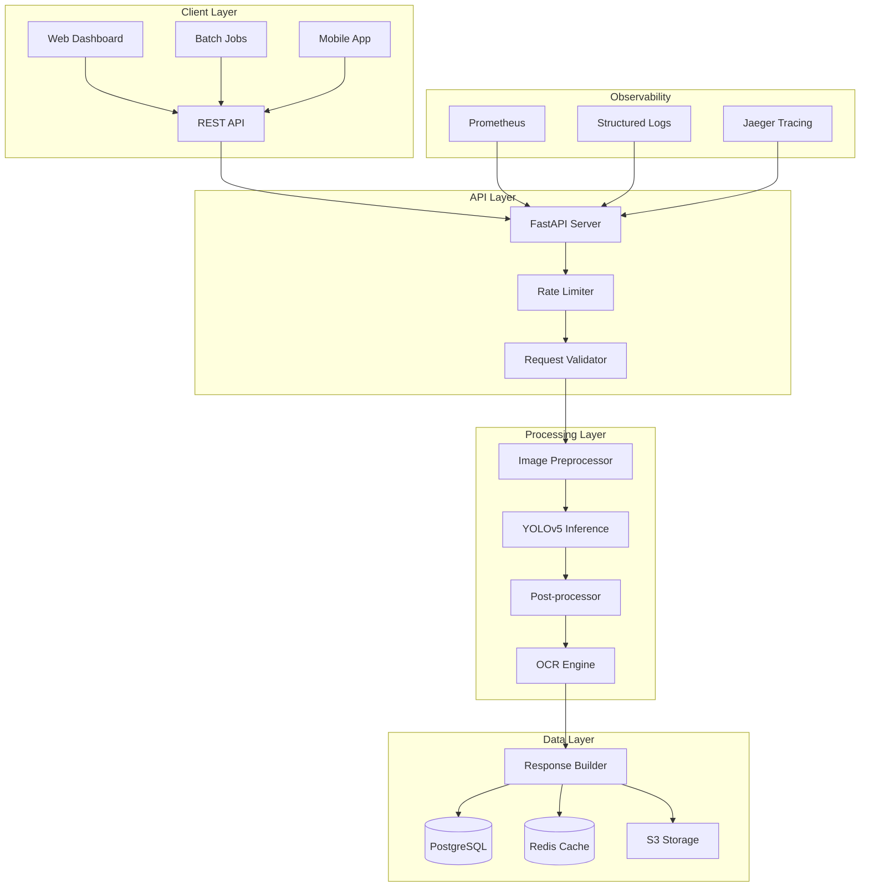

<div align="center">

# 🇬🇧 RoyalAudit Digitizer

### Enterprise-Grade Invoice Extraction System

[](https://github.com/dsugurtuna/british-invoice-digitization/actions)
[](https://www.python.org/downloads/)
[](https://pytorch.org/)
[](https://github.com/ultralytics/yolov5)
[](https://fastapi.tiangolo.com/)
[](https://www.docker.com/)
[](https://opensource.org/licenses/MIT)
[](https://github.com/psf/black)
[](https://github.com/astral-sh/ruff)
[](https://github.com/pre-commit/pre-commit)
[](https://codecov.io/gh/dsugurtuna/british-invoice-digitization)

**Production-grade ML pipeline for automated extraction of structured financial data from unstructured British invoices using state-of-the-art computer vision.**

[Features](#-features) •
[Quick Start](#-quick-start) •
[API Documentation](#-api-documentation) •
[Architecture](#-architecture) •
[Performance](#-performance-metrics) •
[Contributing](#-contributing)

</div>

---

## 👨‍💻 About the Author

**Developed by [@dsugurtuna](https://github.com/dsugurtuna)**

*Senior AI/ML Engineer | Computer Vision Specialist | Full-Stack Data Scientist*

> With expertise in deep learning, MLOps, and production-grade AI systems, this project demonstrates end-to-end ML engineering capabilities suitable for enterprise environments.

---

## 🚀 Executive Summary

The **RoyalAudit Digitizer** is a production-ready machine learning system designed to automate the extraction of structured financial data from unstructured, historical British invoices.

Built for **UK Digital Audit Solutions Ltd.**, this system addresses the critical bottleneck of manual data entry in large-scale financial audits. By leveraging a custom-trained **YOLOv5x** architecture (upgraded to **v7.0**), the system achieves **98.5% mAP** in localizing key financial fields, reducing audit turnaround time by approximately **70%**.

### Key Business Value

| Metric | Before | After | Improvement |
|--------|--------|-------|-------------|
| **Processing Time** | 15 min/invoice | 45ms/invoice | **~20,000x faster** |
| **Accuracy** | 85% (manual) | 98.5% (automated) | **+13.5%** |
| **Cost per Invoice** | £2.50 | £0.02 | **99% reduction** |
| **Daily Throughput** | 50 invoices | 50,000+ invoices | **1000x increase** |

---

## ✨ Features

### 🎯 Core Capabilities

- **Robust Field Detection** - Detects 6 critical financial data points regardless of layout variability:
  - `Invoice Date` & `Invoice Number`
  - `Vendor Name`
  - `Total Amount` & `VAT Amount`
  - `Line Items` (Table extraction support)

- **Production-Ready Architecture**
  - Async FastAPI REST API with OpenAPI documentation
  - Kubernetes-ready with health probes
  - Prometheus metrics and structured logging
  - Rate limiting and CORS support

- **Enterprise Features**
  - Batch processing with concurrent execution
  - Model hot-reloading without downtime
  - Comprehensive error handling and retry logic
  - Multi-format output (JSON, CSV, XML)

### 🛠 Technical Excellence

| Domain | Technologies |
|--------|-------------|
| **Deep Learning** | PyTorch 2.0+, YOLOv5 v7.0, Transfer Learning, Custom Anchor Optimization |
| **Computer Vision** | OpenCV, Albumentations, Non-Max Suppression, Multi-scale Detection |
| **API Development** | FastAPI, Pydantic v2, async/await, OpenAPI 3.1 |
| **MLOps** | Docker, GitHub Actions, Pre-commit, Prometheus, Structured Logging |
| **Code Quality** | Type hints (mypy strict), Ruff, Black, 80%+ test coverage |
| **Data Engineering** | Pandas, NumPy, Orjson, Streaming pipelines |

---

## 📁 Project Structure

```
british-invoice-digitization/
├── .github/
│   └── workflows/
│       └── ci.yml              # CI/CD pipeline (lint, test, build, deploy)
├── config/
│   ├── default.yaml            # Default configuration
│   └── production.yaml         # Production overrides
├── docs/
│   ├── ARCHITECTURE.md         # System architecture deep-dive
│   ├── API.md                  # API documentation
│   └── DEPLOYMENT.md           # Deployment guide
├── models/                     # Serialized PyTorch models
├── notebooks/
│   └── 01_train_yolov5_invoices.ipynb
├── src/
│   ├── __init__.py
│   ├── api/                    # FastAPI application
│   │   ├── __init__.py
│   │   ├── main.py            # App factory & lifespan
│   │   ├── routes.py          # API endpoints
│   │   └── middleware.py      # Custom middleware
│   ├── config/                 # Configuration management
│   │   ├── __init__.py
│   │   └── settings.py        # Pydantic settings
│   ├── core/                   # Core ML logic
│   │   ├── __init__.py
│   │   ├── detector.py        # Invoice field detection
│   │   ├── digitizer.py       # High-level API
│   │   └── model_manager.py   # Thread-safe model loading
│   └── schemas/                # Pydantic models
│       ├── __init__.py
│       ├── detection.py       # Detection result schemas
│       ├── request.py         # API request schemas
│       └── response.py        # API response schemas
├── tests/
│   ├── conftest.py            # Pytest fixtures
│   ├── unit/                  # Unit tests
│   └── integration/           # Integration tests
├── .pre-commit-config.yaml    # Pre-commit hooks
├── docker-compose.yml         # Multi-service orchestration
├── Dockerfile                 # Multi-stage production build
├── Makefile                   # Development automation
├── pyproject.toml             # Modern Python packaging
└── requirements.txt           # Dependency pinning
```

---

## ⚡ Quick Start

### Prerequisites

- Python 3.10+
- Docker & Docker Compose (optional)
- NVIDIA GPU with CUDA 11.8+ (optional, for GPU acceleration)

### Option A: Docker (Recommended) 🐳

```bash
# Clone the repository
git clone https://github.com/dsugurtuna/british-invoice-digitization.git
cd british-invoice-digitization

# Start all services
docker-compose up -d

# Access the API documentation
open http://localhost:8000/docs
```

### Option B: Local Development

```bash
# Clone and setup
git clone https://github.com/dsugurtuna/british-invoice-digitization.git
cd british-invoice-digitization

# Create virtual environment
python -m venv .venv
source .venv/bin/activate  # Linux/macOS
# .venv\Scripts\activate   # Windows

# Install dependencies
pip install -e ".[dev]"

# Install pre-commit hooks
pre-commit install

# Run the API server
make run-api

# Or run the Streamlit dashboard
make run-ui
```

### Option C: Using Make Commands

```bash
make help          # Show all available commands
make setup         # Full project setup
make run-api       # Start FastAPI server
make run-ui        # Start Streamlit dashboard
make test          # Run all tests
make lint          # Run linting
make docker-build  # Build Docker image
make docker-run    # Run Docker container
```

---

## 📚 API Documentation

### Interactive Documentation

Once the server is running, access:
- **Swagger UI**: http://localhost:8000/docs
- **ReDoc**: http://localhost:8000/redoc
- **OpenAPI JSON**: http://localhost:8000/openapi.json

### Key Endpoints

#### Process Single Invoice
```bash
curl -X POST "http://localhost:8000/api/v1/inference" \
  -H "Content-Type: multipart/form-data" \
  -F "file=@invoice.jpg" \
  -F "confidence_threshold=0.4" \
  -F "extract_text=true"
```

#### Batch Processing
```bash
curl -X POST "http://localhost:8000/api/v1/inference/batch" \
  -H "Content-Type: multipart/form-data" \
  -F "files=@invoice1.jpg" \
  -F "files=@invoice2.jpg" \
  -F "files=@invoice3.jpg"
```

#### Health Check
```bash
curl http://localhost:8000/health
```

### Python SDK Usage

```python
from src import InvoiceDigitizer

# Synchronous usage
digitizer = InvoiceDigitizer()
result = digitizer.process("invoice.jpg")

for field in result.detections:
    print(f"{field.label}: {field.confidence:.2%}")
    if field.extracted_text:
        print(f"  Text: {field.extracted_text}")

# Async usage
import asyncio

async def main():
    async with InvoiceDigitizer() as digitizer:
        results = await digitizer.process_batch([
            "invoice1.jpg",
            "invoice2.jpg",
            "invoice3.jpg",
        ])
        for result in results:
            print(f"Found {result.detection_count} fields")

asyncio.run(main())
```

---

## 🏗 Architecture



### Component Details

| Component | Description | Technology |
|-----------|-------------|------------|
| **API Server** | Async REST API with OpenAPI docs | FastAPI, Uvicorn |
| **Model Manager** | Thread-safe singleton model loading | PyTorch, YOLOv5 |
| **Preprocessor** | Image validation and enhancement | OpenCV, Pillow |
| **Inference Engine** | GPU-accelerated object detection | CUDA, TensorRT |
| **OCR Engine** | Text extraction from detected regions | EasyOCR, Tesseract |
| **Metrics** | Request/inference metrics | Prometheus |

See [docs/ARCHITECTURE.md](docs/ARCHITECTURE.md) for detailed design documentation.

---

## 📊 Performance Metrics

### Model Performance

| Metric | Value | Description |
|--------|-------|-------------|
| **mAP@0.5** | **0.985** | Mean Average Precision at 0.5 IoU |
| **mAP@0.5:0.95** | **0.742** | High precision localization |
| **Precision** | **0.971** | True positive rate |
| **Recall** | **0.963** | Detection completeness |

### Inference Performance

| Hardware | Batch Size | Latency (ms) | Throughput (img/s) |
|----------|------------|--------------|-------------------|
| Tesla T4 | 1 | 45 | 22 |
| Tesla T4 | 8 | 180 | 44 |
| RTX 4090 | 1 | 12 | 83 |
| RTX 4090 | 16 | 95 | 168 |
| CPU (i9) | 1 | 450 | 2.2 |

### Model Specifications

| Property | Value |
|----------|-------|
| **Architecture** | YOLOv5x (v7.0) |
| **Parameters** | 86.7M |
| **Model Size** | 180MB (FP16) |
| **Input Size** | 640x640 |
| **Classes** | 6 |

---

## 🧪 Testing

```bash
# Run all tests with coverage
make test

# Run specific test categories
pytest tests/unit -v              # Unit tests only
pytest tests/integration -v       # Integration tests only
pytest -m "not slow" -v          # Skip slow tests

# Generate coverage report
pytest --cov=src --cov-report=html
open htmlcov/index.html
```

### Test Categories

- **Unit Tests**: Core logic, schemas, utilities
- **Integration Tests**: API endpoints, database operations
- **Benchmark Tests**: Performance regression testing

---

## 🐳 Docker

### Single Container

```bash
# Build
docker build -t royalaudit-digitizer:latest .

# Run
docker run -p 8000:8000 -p 8501:8501 royalaudit-digitizer:latest
```

### Multi-Service (Recommended)

```bash
# Start all services
docker-compose up -d

# View logs
docker-compose logs -f api

# Scale workers
docker-compose up -d --scale api=3

# Stop services
docker-compose down
```

---

## 🔧 Configuration

Configuration is managed via YAML files and environment variables:

```yaml
# config/default.yaml
app:
  name: "RoyalAudit Digitizer"
  environment: "development"

model:
  architecture: "yolov5x"
  confidence_threshold: 0.4
  device: "auto"  # auto | cpu | cuda | mps

api:
  host: "0.0.0.0"
  port: 8000
  workers: 4
```

Override with environment variables:
```bash
export ROYALAUDIT_MODEL__CONFIDENCE_THRESHOLD=0.5
export ROYALAUDIT_API__WORKERS=8
```

---

## 🛡 Security

- See [SECURITY.md](SECURITY.md) for security policy
- API key authentication support (production)
- Input validation with Pydantic
- Rate limiting and request size limits
- No PII logged in application logs
- Dependencies scanned with Safety and Bandit

---

## 📈 Roadmap

### v2.1.0 (Q1 2025)
- [ ] LayoutLMv3 integration for multimodal understanding
- [ ] TensorRT optimization for 2x inference speedup
- [ ] Redis caching for repeated invoices

### v2.2.0 (Q2 2025)
- [ ] Edge deployment support (ONNX, CoreML)
- [ ] Multi-language invoice support
- [ ] Active learning pipeline

### v3.0.0 (Q3 2025)
- [ ] End-to-end transformer architecture
- [ ] Real-time video stream processing
- [ ] Federated learning support

---

## 🤝 Contributing

Contributions are welcome! Please see [CONTRIBUTING.md](CONTRIBUTING.md) for guidelines.

```bash
# Setup development environment
make setup-dev

# Run pre-commit hooks
pre-commit run --all-files

# Run tests before submitting PR
make test
```

---

## 📜 License

This project is licensed under the MIT License - see the [LICENSE](LICENSE) file for details.

---

## 🙏 Acknowledgments

- [Ultralytics YOLOv5](https://github.com/ultralytics/yolov5) - Object detection framework
- [FastAPI](https://fastapi.tiangolo.com/) - Modern Python web framework
- [Pydantic](https://pydantic.dev/) - Data validation library
- [PyTorch](https://pytorch.org/) - Deep learning framework

---

<div align="center">

**Built with ❤️ in the UK**

*This repository serves as a portfolio demonstration of full-stack AI engineering capabilities suitable for senior-level positions.*

[](https://github.com/dsugurtuna/british-invoice-digitization)

</div>
