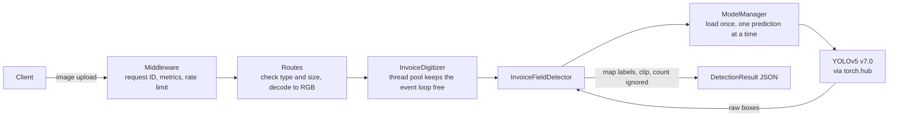

# British invoice digitisation

Locates six fields on invoice page images with a YOLOv5 detector, and serves the boxes through a small, tested FastAPI service.

[](https://github.com/dsugurtuna/british-invoice-digitization/actions/workflows/ci.yml)

[](LICENSE)

> **Status.** The serving and pipeline code is tested in CI. The model is not: this repository
> publishes no trained weights and no accuracy results. The training notebook is a recipe that
> has not been run here. See [What is verified](#what-is-verified-and-what-is-not).

## The problem

Keying invoice details into a finance system by hand is slow and error-prone. Supplier layouts
vary, so fixed templates break whenever a new supplier appears. A layout detector can find where
each field sits on the page, whatever the layout. That is the first step of automated capture:
once you know where the total is, you can read it.

## What this does

- Finds boxes for six field types on a page image: invoice date, invoice number, vendor name,
  total amount, VAT amount and line items. Each box has a confidence score.
- Serves this through an HTTP API: single images, small batches, health checks and Prometheus
  metrics. Threshold changes and model reloads need an admin key.
- Reports what it dropped. Boxes with an unknown class, or with no area left after clipping to
  the page, are counted in `ignored_detections` instead of vanishing.
- Stamps every result with the model's source and a SHA-256 prefix of the weights file.

It does **not** read the text inside the boxes (there is no OCR step; `extracted_text` is
always `null`), accept PDFs, check that totals add up, or ship trained weights. Nothing in the
code is specific to British invoices apart from the field list.

## Quickstart

These commands were run on Python 3.11 and 3.12. They need no PyTorch, weights, network model
downloads or GPU.

```bash
git clone https://github.com/dsugurtuna/british-invoice-digitization.git
cd british-invoice-digitization
python3 -m venv .venv && source .venv/bin/activate    # Python 3.11 or 3.12
pip install -e ".[dev]"
pytest --cov --cov-fail-under=80
```

To explore the API without a model, start it with preloading off:

```bash
INVOICE_DIGITIZER_MODEL__PRELOAD=false invoice-digitizer
# in a second terminal:
curl http://127.0.0.1:8000/health            # "degraded": no model loaded
curl http://127.0.0.1:8000/api/v1/classes    # the six field types
```

Interactive docs are at <http://127.0.0.1:8000/docs>. Until weights exist, inference answers
`503` with instructions. With preloading on (the default), the server refuses to start without
weights, so a misconfigured deployment fails at once instead of serving empty answers.

### With a trained model (not verified in this repository)

```bash
pip install torch torchvision --index-url https://download.pytorch.org/whl/cpu
pip install -e ".[yolov5]"
cp /path/to/best.pt models/invoice_fields.pt    # from notebooks/01_train_yolov5_invoices.ipynb
invoice-digitizer
curl -F "file=@page.png;type=image/png" http://127.0.0.1:8000/api/v1/inference
```

On first load, `torch.hub` downloads the YOLOv5 v7.0 code from GitHub. From Python:

```python
from invoice_digitizer import InvoiceDigitizer

with InvoiceDigitizer() as digitizer:  # loads models/invoice_fields.pt on first use
    result = digitizer.process("page.png")

for field in result.detections:
    print(field.label, round(field.confidence, 2), field.bounding_box.to_xyxy())
print("ignored boxes:", result.metadata.ignored_detections)
```

## How it works


```mermaid
flowchart LR
    C[Client] -->|image upload| M["Middleware<br/>request ID, metrics, rate limit"]
    M --> R["Routes<br/>check type and size, decode to RGB"]
    R --> D["InvoiceDigitizer<br/>thread pool keeps the event loop free"]
    D --> F[InvoiceFieldDetector]
    F --> MM["ModelManager<br/>load once, one prediction at a time"]
    MM --> Y["YOLOv5 v7.0<br/>via torch.hub"]
    Y -->|raw boxes| F
    F -->|"map labels, clip, count ignored"| J[DetectionResult JSON]
```

1. The route checks the content type and size, then decodes the upload with Pillow to an RGB
   array, applying EXIF orientation.
2. `InvoiceDigitizer` runs detection in a worker thread so the API stays responsive.
3. `ModelManager` loads the model once and holds a lock around each prediction, because the
   YOLOv5 wrapper stores its thresholds as mutable attributes.
4. `InvoiceFieldDetector` maps class names to field types, clips boxes to the page, drops and
   counts anything unusable, and returns the fields sorted by confidence.

Illustrative example of a response (abridged; the numbers are made up):

```json
{
  "status": "success",
  "request_id": "0b6f0a55-4f6e-4f1a-9a55-2d1c8f5e7a10",
  "result": {
    "metadata": {
      "model_version": "ultralytics/yolov5:v7.0 weights sha256:3f2a9c1b7d4e",
      "device": "cpu",
      "image_width": 1654,
      "image_height": 2339,
      "image_source": "upload",
      "ignored_detections": 1
    },
    "detections": [
      {
        "label": "Total Amount",
        "confidence": 0.91,
        "bounding_box": {"x_min": 1180.0, "y_min": 1910.0, "x_max": 1520.0, "y_max": 1975.0},
        "extracted_text": null
      }
    ],
    "error": null
  }
}
```

## API

| Method | Path | Purpose | Access |
| --- | --- | --- | --- |
| GET | `/health`, `/health/live`, `/health/ready` | Health; ready means the model is in memory | open |
| POST | `/api/v1/inference` | One image (JPEG, PNG, TIFF, BMP, WebP) | open |
| POST | `/api/v1/inference/batch` | Several images; failures reported per file | open |
| GET | `/api/v1/model/info` | What is loaded, from where, and the thresholds | open |
| GET | `/api/v1/classes` | The six field types | open |
| PUT | `/api/v1/model/config` | Change thresholds for this process | admin key |
| POST | `/api/v1/model/reload` | Reload the weights for this process | admin key |
| GET | `/metrics` | Prometheus metrics | open |

Inference endpoints accept `confidence_threshold` (and `iou_threshold` for single images) as
query parameters. An override applies to that request only.

## Configuration

Settings come from environment variables (prefix `INVOICE_DIGITIZER_`, nested with `__`), then
an optional YAML file, then built-in defaults. [`config/default.yaml`](config/default.yaml)
lists every option with its default.

| Setting | Default | Why it matters |
| --- | --- | --- |
| `INVOICE_DIGITIZER_MODEL__WEIGHTS_PATH` | `models/invoice_fields.pt` | Trained weights; not in the repository |
| `INVOICE_DIGITIZER_MODEL__CONFIDENCE_THRESHOLD` | `0.4` | Boxes below this are not returned |
| `INVOICE_DIGITIZER_MODEL__DEVICE` | `auto` | `cpu`, `cuda` or `mps`; `auto` picks one |
| `INVOICE_DIGITIZER_MODEL__PRELOAD` | `true` | Load at start-up and fail fast |
| `INVOICE_DIGITIZER_API__ADMIN_API_KEY` | unset | Unset keeps the admin endpoints off |
| `INVOICE_DIGITIZER_API__HOST` | `127.0.0.1` | Set `0.0.0.0` only inside a container |
| `INVOICE_DIGITIZER_CONFIG_FILE` | unset | Path to a YAML file like `config/default.yaml` |

## What is verified and what is not

| Claim | Evidence |
| --- | --- |
| API, validation, batching, admin key, rate limit and metrics behave as described | Integration tests against a fake model (`tests/integration`) |
| Pipeline: RGB loading, label mapping, clipping, ignored counts, error results | Unit tests (`tests/unit`) |
| Model manager: loads once under concurrency, predictions never overlap, reload keeps the old model on failure, per-request thresholds do not leak | Unit tests with threads (`tests/unit/test_model_manager.py`) |
| The YOLOv5 adapter calls `torch.hub` with the pinned repo, path and device, and converts its output | Unit tests against a fake `torch` (`tests/unit/test_yolov5_backend.py`) |
| Lint, formatting and strict typing | `ruff check`, `ruff format --check`, `mypy` in CI |
| Real YOLOv5 v7.0 code and weights load and run with current PyTorch | **Not verified.** YOLOv5 v7.0 predates PyTorch 2.6, which changed `torch.load` to load weights only by default. Its checkpoints are full Python pickles, so loading may fail on new PyTorch and would need an older PyTorch or an explicit opt-out. Only load weights you trust: unpickling can run code. |
| The Docker image builds and runs | **Not verified.** Not built since the last changes. |
| Detection accuracy on invoices | **Unknown.** No weights or evaluation results are published. |

## Design decisions

Each choice is explained in [docs/WHY.md](docs/WHY.md). In short:

- **PyTorch is imported in one module only**, so the service logic installs and tests in
  seconds on any machine, and CI never downloads the CUDA stack.
- **One model per process, one prediction at a time.** Correct first; scale with processes.
- **Per-request thresholds never touch shared state.** The earlier version leaked them.
- **No silent fallback.** Missing weights stop start-up; unusable boxes are counted, not hidden.
- **Read freely, write carefully.** Changing the running service needs a key; reading does not.
- **The YOLOv5 code version is pinned to a release tag**, the same one the notebook trains with.

## Limitations and what it is not

- A layout detector, not a digitiser end to end: no OCR, no field values, no totals checks.
- Accuracy is unknown until someone trains and evaluates weights on a described dataset.
- Confidence scores are not calibrated probabilities. The 0.6 "needs review" and 0.8 "high
  confidence" cut-offs are conventions.
- State is per process. Threshold changes, reloads and rate limits apply only to the process
  that handles the request.
- The rate limiter is in memory, keyed by client address. Behind a proxy, all clients share one
  address.
- Inference endpoints have no authentication. Put the service behind your own gateway.
- `torch.hub` with `trust_repo=True` downloads and runs code from GitHub at first load. The tag
  is pinned, but this is still a supply-chain dependency.
- No PDF input and no multi-page documents.

## Project layout

```text
src/invoice_digitizer/
  api/            FastAPI app factory, routes, middleware, metrics
  config/         settings (env > YAML > defaults)
  core/           images, model manager, YOLOv5 adapter, detector, digitizer
  schemas/        request, response and result models
tests/
  unit/           pipeline, settings, model manager, adapter
  integration/    the HTTP API with a fake model
notebooks/        training recipe (not run here)
config/           example settings and Prometheus scrape config
docs/WHY.md       why it is built this way
```

## Roadmap

1. A generator for synthetic, labelled invoice pages, so training and evaluation can be
   reproduced without real documents.
2. A small baseline model trained on that data, with `val.py` results and the exact command.
3. An OCR step per box, measured end to end: field values correct, and the total human effort
   including checking and correction.
4. A CI job that loads YOLOv5 on CPU and builds the Docker image.
5. PDF and multi-page input.

## Licence

MIT. See [LICENSE](LICENSE).

## History

Earlier versions of this README presented the project as "RoyalAudit Digitizer", built for a
named company, with mAP, speed, cost and throughput figures. Nothing in the repository supports
those claims, so they have been removed. See [CHANGELOG.md](CHANGELOG.md).

---

Personal project by [Ugur Tuna](https://github.com/dsugurtuna). Not affiliated with or endorsed by any employer.
