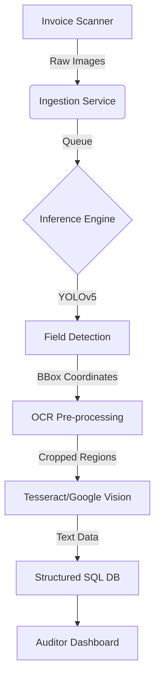

# System Architecture: RoyalAudit Digitizer

## 1. High-Level Design

The RoyalAudit Digitizer is designed as a microservice-ready application that fits into a larger Enterprise Resource Planning (ERP) ecosystem.

## 2. Component Details

### 2.1 Inference Engine (`src/inference.py`)
*   **Pattern:** Singleton-like instantiation of the YOLOv5 model to minimize VRAM overhead.
*   **Optimization:** Uses `torch.hub` for model loading with FP16 (half-precision) inference capabilities enabled when CUDA is detected.
*   **Scalability:** Designed to be stateless. Multiple instances can be spun up behind a load balancer (e.g., NGINX) to handle high throughput.

### 2.2 Data Pipeline
*   **Augmentation:** To handle the variability of historical British documents (faded ink, coffee stains, folds), we employ a rigorous augmentation pipeline:
    *   Mosaic Augmentation (combining 4 images)
    *   HSV Color Space manipulation
    *   Random affine transformations (rotation, scaling)

## 3. Security & Compliance
*   **Data Privacy:** No PII is logged in the application logs.
*   **Audit Trails:** All inference requests are timestamped and tagged with a unique request ID.

## 4. Future Roadmap
*   **Phase 2:** Integration of LayoutLMv3 for multimodal (text + image) understanding.
*   **Phase 3:** Real-time edge deployment on mobile devices for field auditors.
